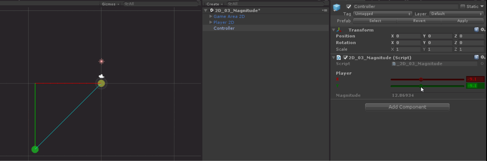

# Unity-Vectors 

### Used versions
* Unity: <b>2017.3.1f1</b>
* .NET Framework: <b>4.7.1</b>

##### Useful links
* [Unity User Manual](https://docs.unity3d.com/Manual/index.html)
* [UnityDecompiled](https://github.com/MattRix/UnityDecompiled) [*](https://twitter.com/MattRix/status/961634719795503109)
* [The Nature of Code: Simulating Natural Systems with Processing](http://natureofcode.com/book/)
 * YouTube channels
    * [Abhinav a.k.a Demkeys](https://www.youtube.com/user/AbhiDemkeys)
    * [Brackeys](https://www.youtube.com/user/Brackeys)
    * [BurgZerg Arcade](https://www.youtube.com/user/BurgZergArcade)
    * [inScope Studios](https://www.youtube.com/user/KnnthRA)
    * [Jayanam](https://www.youtube.com/user/jayanamgames)
    * [Jorge Rodriguez](https://www.youtube.com/user/BSVino)
    * [N3K EN](https://www.youtube.com/channel/UCtQPCnbIB7SP_gM1Xtv8bDQ)
    * [Physics Videos by Eugene Khutoryansky](https://www.youtube.com/user/EugeneKhutoryansky)
    * [Sebastian Lague](https://www.youtube.com/user/Cercopithecan)
